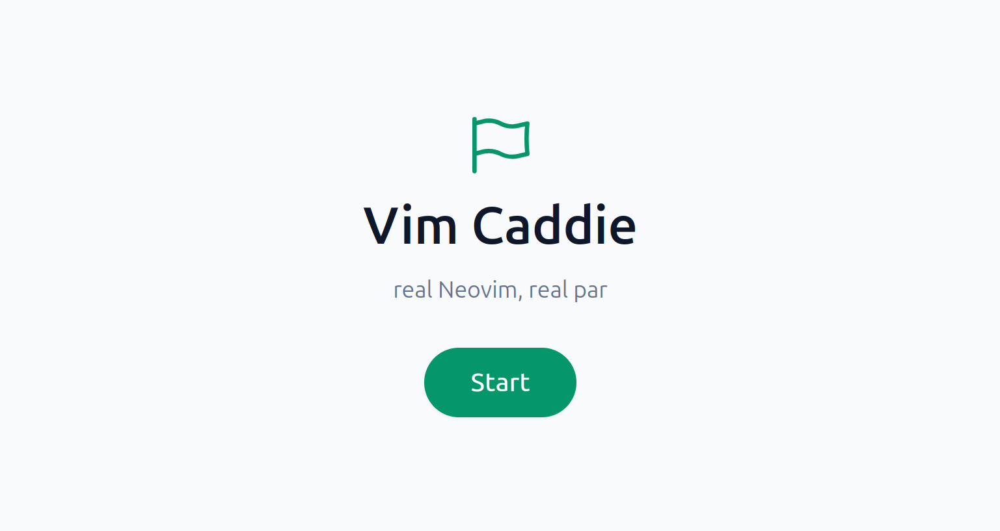
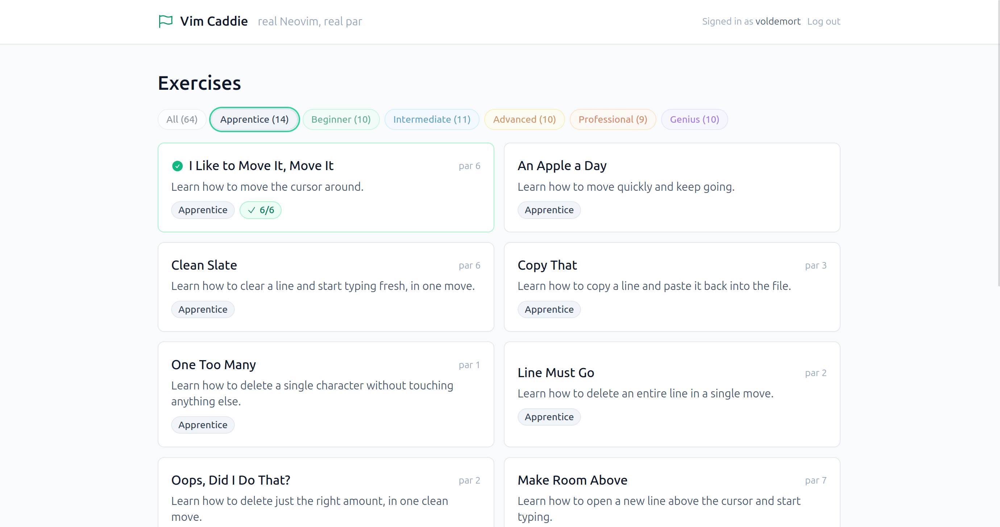
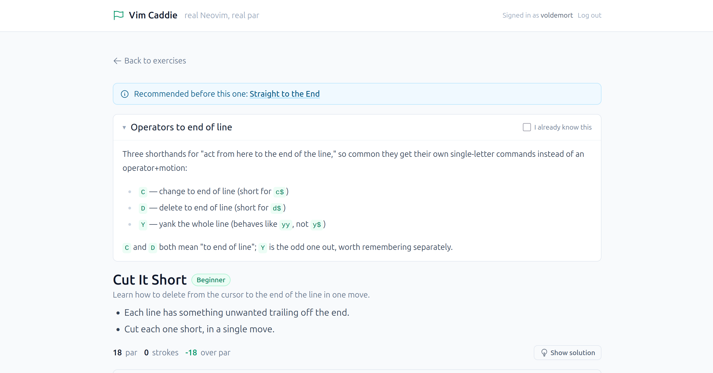
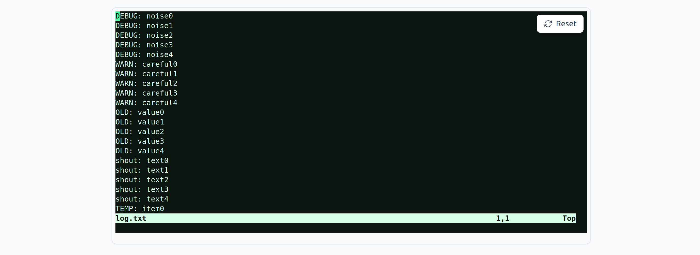
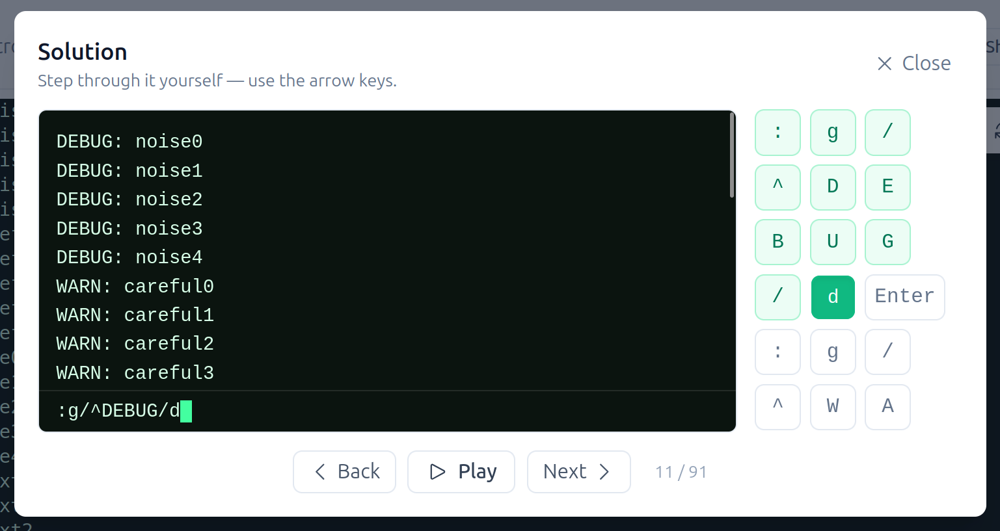

# Vim Caddie

> **Learn Vim by playing it like a sport.**



Stop watching cheat sheets and start playing. Vim Caddie is a fun,
gamified way to learn Vim against a **real, live Neovim** — not a fake
keyboard-shortcuts quiz, not a video, an actual terminal running actual
`nvim`, right in your browser.

Every exercise is a real editing problem with a real par: the fewest 
keystrokes a genuine Vim pro would need to
solve it. Beat par, hole out, level up.

Inspired by [Vim Golf](https://www.vimgolf.com/), built to actually
*teach*: each hole comes with the theory behind the trick it's testing,
so you're not just memorizing a solution — you're picking up a technique
you'll reach for again

That's the whole pitch: **learn Vim, get fast, become the person who actually knows
what they're doing in a terminal.**

## See it in action

**Browse by tier.** All exercises, six tiers from Apprentice to
Genius, par and your progress on every one.



**Know the trick before you need it.** Every exercise opens with the
exact technique it's testing — no keystrokes shown up front, just the
objective.



**A real, live terminal.** This is an actual `nvim` process rendering to
your browser — not a lookalike.



**Stuck? Step through the real solution**, one keystroke at a time, and
see exactly what each one does.



## Why you'll want this

- 🎮 **Actually fun.** Vim Golf scoring, live keystroke feedback, and a
  progression of tiers from your first `hjkl` move to genuinely devious
  multi-concept challenges — this is a game first, a tutorial second.
- 🖥️ **A real Neovim, not a simulation.** Every exercise runs inside a
  real, sandboxed `nvim` process. What you learn here is exactly what
  works in your own terminal tomorrow.
- 📈 **Built to make you better, not just entertained.** Par isn't
  arbitrary — it's the keystroke-efficient solution, and each tier
  demands combining *more* of what you've learned, not just typing
  faster. That's what turns "I know some Vim commands" into "I'm fast in
  Vim."
- 📚 **Theory when you need it, never before.** Stuck on a hole? A short,
  focused explanation of the exact technique it's testing is one click
  away — no wall of documentation to read first.
- 🏆 **Your progress, tracked.** Sign in, and every hole you've solved and
  your best stroke count for it are right there waiting for you next
  time.

## Features

- **Vim Golf mechanics** — solve real text-editing puzzles using the
  fewest keystrokes possible, scored live as you type.
- **A real terminal, not a mockup** — a genuine `nvim` session streamed
  straight to your browser, sandboxed and disposable per attempt.
- **Six tiers of difficulty** — from your very first `hjkl` move up
  through exercises that demand combining half a dozen techniques at
  once, never solved by grinding out the same trick over and over.
- **Theory pills** — bite-sized explanations of exactly the concept each
  exercise is testing, shown right where you need them.
- **Real accounts, real progress** — sign up, sign in, and keep a
  history of everything you've holed out and your best score for it.

## Get playing

For now, playing is on your side, so host Vim Caddie yourself!

```sh
git clone https://github.com/jjimenezgarcia/vim-caddie.git && cd vim-caddie
docker compose up --build
```

Then open **http://localhost:8080** and start golfing.

For configuration, deployment architecture, and the security design
behind it, see **[docs/DEPLOYMENT.md](docs/DEPLOYMENT.md)**.

## Contributing

Want to write a new exercise, or add to the theory content that backs
them?

- **[docs/how-to-write-an-exercise.md](docs/how-to-write-an-exercise.md)**
  — the exercise schema, how difficulty is actually decided, and the
  tool that verifies a new exercise against a real Neovim before it
  ships.
- **[docs/how-to-write-pills.md](docs/how-to-write-pills.md)** — how the
  short theory explanations each exercise links to are structured, and
  what makes a good one.
